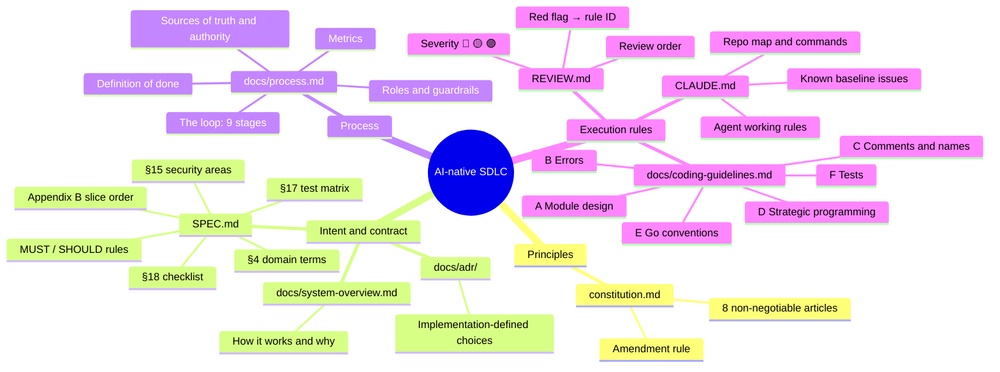
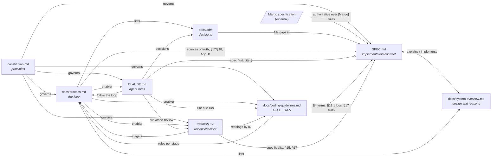

# Documentation Map

How the process documents relate. GitHub renders the diagrams below.

## Mind map: what each document is for

## Link graph: who references whom

## How they are used in the loop

| Loop stage (`docs/process.md` §3) | Documents read | Documents written |
| --- | --- | --- |
| 1 Intent · 2 Spec | `SPEC.md`, `docs/system-overview.md`, `docs/adr/` | `SPEC.md`, ADR |
| 3 Plan | `CLAUDE.md`, `SPEC.md`, `docs/coding-guidelines.md` (A, G-A7) | Plan |
| 4 Tests | `SPEC.md` §17, `docs/coding-guidelines.md` (F) | Tests |
| 5 Implement | `CLAUDE.md`, `docs/coding-guidelines.md` (B, C, E) | Code |
| 6 Verify | `CLAUDE.md` (commands) | — |
| 7 Review | `REVIEW.md`, `docs/coding-guidelines.md`, `SPEC.md` | Review findings |
| 8 Merge | `docs/process.md` §5, `SPEC.md` §18 | §18 checklist |
| 9 Learn | Review history | `CLAUDE.md`, `docs/coding-guidelines.md` |

## Documents

- [constitution.md](../constitution.md)
- [SPEC.md](../SPEC.md)
- [docs/system-overview.md](system-overview.md)
- [docs/adr/](adr/)
- [docs/process.md](process.md)
- [CLAUDE.md](../CLAUDE.md)
- [docs/coding-guidelines.md](coding-guidelines.md)
- [REVIEW.md](../REVIEW.md)
